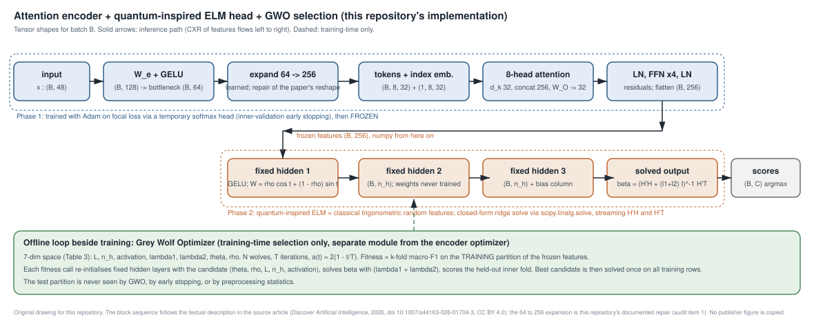

# attention-qelm-gwo-iiot-lab

Industrial IoT intrusion detection has to find rare attack classes inside traffic that is
mostly normal, and the classifier has to be cheap enough to retrain often. This repository
is an independent, CPU-only implementation of an attention encoder whose frozen features
feed a fixed-weight extreme learning machine with a closed-form output layer, with a grey
wolf optimizer selecting the ELM hyperparameters on the training partition, plus a
fidelity audit of the design against the source paper.

**Status:** `demo_ready` (runs end to end on authored synthetic fixtures; no real-data
evaluation performed in this repository).

## Problem and user

The user is an analyst or engineer who wants to (a) read a runnable, shape-annotated
version of the attention + QELM + GWO design, (b) run it on their own processed
Edge-IIoTset table through a strict 48-column manifest, and (c) see exactly where the
paper's description is ambiguous and what this code assumes. It is a laboratory, not a
deployed detector.

## Demo

```
python -m attention_qelm_gwo_iiot_lab demo
```

writes `examples/output/`: `metrics.json` (multiclass, binary, three sklearn baselines,
five-seed mean and sample SD, Friedman/Holm), `predictions.csv`, `demo_trace.json`
(per-stage tensor shapes from feature tokens through attention, fixed hidden layers and
the solved output), `gwo_trace.json`, `learning_curves.json`, `roc_curves.json`,
`audit.json`, `run_manifest.yaml`. `python tools/render_figures.py` turns those files into
`docs/figures/*.svg`. Every metric in those files is labelled `demo` and was computed on
the synthetic fixture; see [docs/evaluation.md](docs/evaluation.md).

## Implementation status

| Component | Status |
|---|---|
| Edge-IIoTset adapter with strict 48-slot manifest and fixed 15-class order | works (manifest slot names are placeholders you must fill; see `configs/feature_manifest_paper.yaml`) |
| Train-fit preprocessing (drop >40% missing, inf to train max, median/mode, Min-Max), stratified 80/20 + inner k-fold | works, leakage test included |
| Attention encoder (48 -> 128 -> 64 -> explicit 64 -> 256 -> 8 tokens x 32 -> 8-head attention -> FFN -> 256), focal loss, early stopping on inner validation, freeze | works (PyTorch port of a TensorFlow design; differences in MODEL_CARD.md) |
| QELM: fixed trigonometric random hidden layers, streaming H'H / H'T, stable ridge solve, `.npz` persistence | works |
| Elastic-net output solver (true L1) | works, clearly labelled optional extension, not the paper's solver |
| Grey Wolf Optimizer over the 7-dim Table 3 space, cached, seeded, early stop | works; demo budget N=6, T=4 |
| Two-phase `train`, separate binary and multiclass configs | works |
| Baselines: logistic regression, random forest, hist gradient boosting | works |
| Paper baselines CNN-1D, LSTM, GRU, BiLSTM, DenseNet | `proposed`, not implemented |
| Metrics with explicit class order, per-class OvR ROC from scores, multi-seed, Friedman/Holm | works |
| Shortcut audits (identifier-like columns, placeholder encoding, duplicate flows) | `demo` on the fixture, `proposed` on real data |
| Real-data reproduction of any paper number | not performed; nothing is labelled `reproduced` |

## Quickstart (offline, CPU, under a minute)

```
pip install -e . && pip install pytest
python -m attention_qelm_gwo_iiot_lab smoke      # end-to-end schema check on the 15-class fixture
python -m pytest -q
```

Other subcommands: `demo`, `train --config configs/demo_binary.yaml --out <dir>`,
`search --config ... --out <dir>`, `evaluate --predictions <csv> --config <yaml>`,
`audit`, `make-fixture`, `figures`. `make smoke|demo|test|evaluate|train|search|audit|figures`
wrap the same commands.

## Data

No dataset rows are shipped. The demo runs on `examples/fixtures/v1/` (authored synthetic
data, see its `FIXTURE.md`). To run on real data, obtain Edge-IIoTset, apply your own
preprocessing to a 48-feature table, fill the column names into
`configs/feature_manifest_paper.yaml`, and pass `--data-root` (or set `DATA_ROOT`). The
adapter refuses any table whose columns do not match the manifest exactly; it never
truncates or reorders by position. Details in [DATA_CARD.md](DATA_CARD.md) and
[docs/data.md](docs/data.md).

## Architecture / method



Phase 1 trains the encoder with a temporary softmax head (focal loss, gamma 2, alpha 0.25,
times inverse-frequency class weights; Adam lr 1e-3), early-stopped on an inner validation
fold of the training partition, then freezes it. Phase 2 embeds the training rows, lets the
GWO pick the ELM hyperparameters by k-fold macro-F1 on those training embeddings, and solves
the output weights once in closed form with `scipy.linalg.solve` on
`H'H + (lambda1 + lambda2) I`. "Quantum-inspired" means classical trigonometric random
features `W_ij = rho cos(theta_ij) + (1 - rho) sin(theta_ij)`; no quantum hardware is used
and no quantum advantage is claimed. Full description and the settings taken from the paper
are in [docs/method.md](docs/method.md); every ambiguity and the assumption made is in
[docs/paper-implementation-audit.md](docs/paper-implementation-audit.md).

## Train, validate, test

Stratified 80/20 outer split. All preprocessing statistics, the encoder's early stopping
and the GWO fitness use the training partition only (inner stratified k-fold within it).
The test partition is scored once per trained model. Binary (Normal vs Attack) and
multiclass (15 classes, Table 1 order) are separate configs trained separately; binary
predictions are never derived by collapsing multiclass output. A test asserts that
preprocessing statistics do not change when test rows are perturbed, that frozen encoder
weights are untouched by the ELM solve, and that the rarest class appears in every fold.

## Results and provenance

Two kinds of numbers exist in this repository and they are never mixed:

- `paper-reported`: values transcribed from the source article, stored only in
  `evidence/paper_reported/qelm.json` with a `source_locator` per table. They were not
  produced or verified here.
- `demo`: values computed by `python -m attention_qelm_gwo_iiot_lab demo` on synthetic
  fixture v1 in `examples/output/metrics.json`. They describe the pipeline running on
  made-up data and are not benchmark results.

Nothing is labelled `reproduced` because no real-data run was performed. The evidence
file also records an internal inconsistency in the article (two different Friedman
chi-square values).

## Limitations

- The fixture is parametric noise with class-shifted means; performance on it says nothing
  about Edge-IIoTset.
- The 48 processed feature names are not recoverable from the paper; the manifest ships
  placeholders and the real-data adapter will refuse to run until they are filled.
- The paper's reshape from a 64-unit bottleneck to 8 x 32 = 256 is impossible as stated;
  this repository inserts an explicit learned expansion and says so (audit item 1).
- Deep baselines from the paper are not implemented.
- The paper used TensorFlow 2.11; this is a PyTorch port, so initialisation, optimizer
  defaults and the GELU implementation differ (MODEL_CARD.md).
- Multiclass FPR is a macro one-vs-rest average because the paper does not define it.

## Relationship to research

This repository is an independent implementation related to the article
"Attention-guided quantum-inspired extreme learning machine with grey wolf optimization for
rare-attack detection in IIoT networks", Discover Artificial Intelligence, 2026 (article in
press), DOI [10.1007/s44163-026-01704-3](https://doi.org/10.1007/s44163-026-01704-3).
The article cites https://github.com/drmohammedadnan110-ai/Attention-QELM-GWO-IIoT-IDS as
its code source; that repository was not audited or reused here. This code was written from
the article's textual description and is not the authors' code.

## Contribution

Md Sultanul Arefin Sourav.
Contribution: conceptualization, methodology design, implementation, and initial framework development.

## License and sources

MIT License, copyright 2026 Md Sultanul Arefin Sourav (see LICENSE, NOTICE.md). No
datasets, model weights, publisher figures or publisher text are redistributed. The
architecture drawing is an original SVG that follows the article's textual description
(the article is published CC BY 4.0); no publisher figure is copied. Dataset terms:
DATA_CARD.md.
